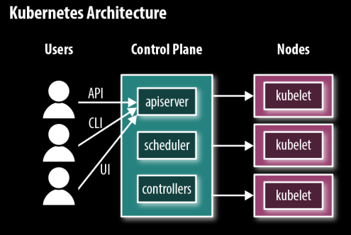
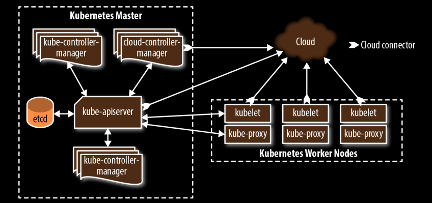

# Kubernetes

For more low-level practical stuff, go to docs on [[docker | Docker]] and [[minikube |Minikube/K8s basics]].

## For what reason?

Kubernetes can be referred to as the "operating system of the cloud native world".\
Kubernetes connects multiple servers into a **cluster**, and is thus used to implement a **cluster architecture**.\
The "cluster's brain" is the **control plane**, which runs all the tasks required for Kubernetes to do its job: scheduling containers, managing services, serving API requests, etc.:

The control plane is made up of the following main components:

- `kube-apiserver` - frontend server of the control plane.
- `etcd` - adtabase where k8s stores all its config data (nodes, resources, *etc*).
- `kube-scheduler` - decides when to run newly created pods.
- `kube-controller-manager` - running resource controllers such as deployments.
- `cloud-controller-manager` - interacts with the cloud provider in cloud-based clusters to do stuff.

**Master nodes** are members of the cluster which run the control plane components.\
**Node components** or **worker nodes** are cluster members that run user workloads.
Each worker node in a k8s cluster runs these components:

- `kubelet` - responsible for driving the container runtime to start workloads that are scheduled on the node & monitoring their status.
- `kube-proxy` - doing the networking "magic" between pods, other nodes and the internet.
- a container runtime - toy to start and stop containers and handle their communication; just `docker` or other container software.

A correctly configured Kubernetes control plane is supposed to provide **high availability** by **running multiple master nodes**. Why? Because if any individual master node were to fail or shut down, or one of the control plane components were to stop abruptly, the cluster shall still work properly.
A highly available control plane will also handle the situation where the master nodes are working properly, but some of them cannot communicate with the others, due to
a network failure (known as a **network partition**).\
The `etcd` database is replicated across multiple nodes and can survive the failure of individual nodes.\
A good workable minimum of running master nodes on prod is 3.

A *control plane failure* would be sorta like the way my OS broke recently[^1] - your stuff *probably* still works, you just can't do nor see shit.\
A *worker node failure* should not matter, because Kubernetes will detect the failure and reschedule the node's pods somewhere else, so long as your control plane hasn't kicked the bucket.\
*Large number of nodes failing synchronously* might imply **a cluster running out of resources.**

> A rare, but entirely possible, kind of failure is losing a whole cloud *availability zone*. Cloud vendors like AWS and Google Cloud provide multiple availability zones in each region, each corresponding roughly to a single data center. For this reason, rather than having all your worker nodes in the same zone, it’s a good idea to distribute them across two or even three zones.

All in all, the book tells me to trust your stuff, but verify it. I say we should not trust our stuff at all and always double-verify it.\
Simulate disasters, even catastrophes and entire revelations and apocalypses. Reboot your master nodes and try to get them to crash. At least you'll know what *might* happen on prod.

## Managed vs. self-hosted - *buy* or *build*?

If you're considering self-hosting a biiiig k8s setup, you might want to consider the following questions:

> [!example]- k8s self-hosting sanity checklist
> 
> - Is the control plane highly available, i.e. if a master node goes down or becomes unresponsive, does your cluster still work?
> - Can you still deploy or update apps?
> - Will your running applications still be fault-tolerant without the
control plane?
> - Is your pool of worker nodes highly available, i.e. if an outage should take down several worker nodes, or even a whole cloud AZ, will your workloads and cluster stop running?
> - Will your cluster be able to automatically provision new nodes to self-heal or will manual intervention be required?
> - Is your cluster set up securely? Think, TLS, SSL, trusted certificates and not being a dummy that forgets to update them (or refresh your GPG keys[^2], if relevant).
> - Do your users and applications have minimal rights and perms for cluster operations? ~~probably not~~
> - Are container security defaults set properly, i.e. you're not using defaults that are absolutely deranged to use depending on your use case?
> - Is access to the underlying `etcd` db properly controlled & authenticated?
> - Are all your services that are exposed directly to the internet secure? Think HTTPS, SSH, and not being a dummy that lets Jia Tan log into a random Jenkins instance on some orphan IPv4 address. 
> - Is your cluster conformant to CNCF standards?
> - Is your config managed and backed up? Do you use IaC and have a ***backup*** backup of it?
> - Do you have a ***backup*** backup of your cluster?

> [!bug] Automated resilience testing tools
>
> Netflix's Chaos Monkey.

*Supplementary book yapping tl;dr:*

Tools don't do it all for you, especially if they promise to be point-and-click, zero-effort or instant ~~gratification~~ (or Gods-forbid "no-code").\
Kubernetes is hard.\
Start off with managed services at first.
There are **Kubernetes installers** that you can use to **build your own clusters**.

> [!example]- k8s cloud-managed madness index
>
> - Google Kuberetes Service (GKE)
> - Amazon Elastic Container Service for Kubernetes (EKS)

[^1]: 15th January 2025 incident involving LightDM and Xorg crashing into oblivion after I flipped the MUX switch; yes, it was a Brazilian BIOS error, also known as "Dumb Animal Operating the System" error. I blame Nvidia drivers, not myself, though.
[^2]: Stares menacingly at ASUS Linux & AUR maintainers.
