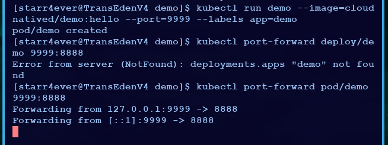

# Minikube

A lot of starter stuff here follows from starter Go+Docker stuff at [[docker | Docker basics]].

## Deploying a Go helowoorld on Minikube

First off, ensure you have Docker installed and Docker group set up. It errors in "no docker group" silly-mode and refuses to get sudo'd (good).

```sh
minikube start
kubectl run demo --image=cloudnatived/demo:hello --port=9999 --labels app=demo
kubectl port-forward pods/demo 9999:8888
kubectl get pods --selector app=demo
```



The error above also portrays how to deal with some silly little name errors - just **read**.

## How to not trainwreck your Minikube

> [!danger]- Docker network pruning
> 
> **DO NOT** run:
> 
> ```sh
> docker network prune
> ```
> 
> Especially if your Minikube cluster isn't running. It might take down with itself the network necessary for Minikube to start. I am not sure what the simplest, non-destructive (so not involving `minikube delete && minikube start` from scratch reset) way to fix this is, but it likely requires you to put together a very unpleasant `docker-network` command.
>
> Source: my own mistakes.
