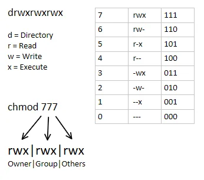

# Unix permissions with `chmod`



## Useful examples:

Make it executable: 
```sh
chmod +x ./run.sh
```
Root only file access:
```sh
chmod 000 ./.creds
```
Read-only exclusively for file owner:
```sh
chmod 400 ./special-toy
```
